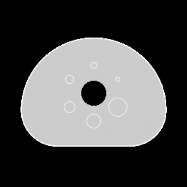

# phantomgen
Virtual NEMA / IEC Nuclear Medicine Phantom Generator

[](LICENSE)
[](https://github.com/varzakis/phantomgen/commits)
[](#installation)

`phantomgen` is a lightweight Python package that generates realistic **3D numerical NEMA / IEC body phantoms** for nuclear medicine simulations, algorithm validation, and dosimetry research.

The package implements the **IEC Body Phantom (NEMA NU-2 / IQ)** geometry and provides ready-to-use parameter sets for **PET** and **EARL** configurations.

---

# Features

- Generate 3D **activity maps**
- Generate **CT attenuation maps (μ-maps)**
- Generate **binary masks for all phantom regions**
- Supports **spherical inserts** and **lung inserts**
- Adjustable **voxel size** and **matrix dimensions**
- Optional **supersampling** to reduce voxelisation artefacts
- Ready-made parameter dictionaries for **PET** and **EARL**
- Pure **NumPy implementation** (no heavy dependencies)

---

# Example Phantom

The figure below shows a central slice of a generated phantom.

| Activity | CT attenuation |
|---------|----------------|
|  |  |

Images can be generated using the visualization example below.

---

# Installation

## From PyPI (recommended)

```bash
pip install phantomgen
```

## From source

```bash
git clone https://github.com/varzakis/phantomgen.git
cd phantomgen
pip install -e .
```

Requirements

- Python ≥ 3.9
- NumPy ≥ 1.23

---

# Quick start

```python
from phantomgen import create_nema, pet_nema_dict

act, ctac, masks = create_nema(nema_dict=pet_nema_dict)

print(act.shape)
print(masks.keys())
```

---

# Python API

```python
import numpy as np
from phantomgen import create_nema, pet_nema_dict

act_vol, ctac_vol, mask_dict = create_nema(
    matrix_size=(256,256,256),
    voxel_size_mm=(2.0,2.0,2.0),
    nema_dict=pet_nema_dict
)

np.save("activity.npy", act_vol)
np.save("ctac.npy", ctac_vol)

np.save("sphere1_mask.npy", mask_dict["sphere_1"])
```

---

# Command line usage

After installation the CLI tool becomes available.

Generate a phantom:

```bash
phantomgen --preset pet
```

Export activity and attenuation volumes:

```bash
phantomgen --preset pet --out-act act.npy --out-ctac ctac.npy
```

Export masks as well:

```bash
phantomgen --preset pet --out-mask-dir masks
```

---

# CLI arguments

| Argument | Default | Description |
|--------|--------|--------|
| `--preset` | `pet` | Phantom preset (`pet`, `earl`) |
| `--z --y --x` | `256 256 256` | Matrix size |
| `--voxel` | `2 2 2` | Voxel size in mm |
| `--out-act` | `activity.npy` | Output activity volume |
| `--out-ctac` | `ctac.npy` | Output CT attenuation map |
| `--out-mask-dir` | None | Directory where masks will be saved |
| `--offset` | `0 0 0` | Global phantom shift in mm |
| `--supersample` | `1` | Supersampling factor |

Example:

```bash
phantomgen   --preset earl   --z 192 --y 192 --x 192   --voxel 2.5 2.5 2.5   --out-mask-dir masks
```

---

# Outputs

`create_nema` returns three objects.

| Output | Type | Unit | Description |
|------|------|------|------|
| `act_vol` | `np.ndarray` | MBq/voxel | Activity distribution |
| `ctac_vol` | `np.ndarray` | cm⁻¹ | CT attenuation map |
| `mask_vols_binary_dict` | `dict[str,np.ndarray]` | binary | Region masks |

Typical mask dictionary keys:

```
background
lung_insert
sphere_1
sphere_2
sphere_3
sphere_4
sphere_5
sphere_6
```

All volumes have shape:

```
(Z, Y, X)
```

Data types:

| Data | dtype |
|-----|------|
| Activity | float32 |
| CT attenuation | float32 |
| Masks | uint8 |

---

# Custom parameters

Default parameter sets can be modified before phantom generation.

```python
from phantomgen import create_nema, pet_nema_dict

custom = pet_nema_dict.copy()
custom["sphere_dict"]["spheres"]["act_conc_MBq_ml"] = [1.0]*6

act, ctac, masks = create_nema(nema_dict=custom)
```

---

# Supersampling

Supersampling improves phantom geometry fidelity by generating the phantom on a higher-resolution grid before downsampling.

Example:

```python
act, ctac, masks = create_nema(
    supersample=4
)
```

During downsampling:

- Activity values are **summed** to conserve total activity
- Attenuation values are **averaged**
- Binary masks are **conservative**: a voxel is included if any supersampled subvoxel intersects the region

---

# Visualization example

```python
import matplotlib.pyplot as plt
from phantomgen import create_nema, pet_nema_dict

act, ct, masks = create_nema(nema_dict=pet_nema_dict)

z = act.shape[0] // 2

fig, ax = plt.subplots(1,2, figsize=(10,5))

ax[0].imshow(act[z], cmap="inferno")
ax[0].set_title("Activity (MBq/voxel)")

ax[1].imshow(ct[z], cmap="gray")
ax[1].set_title("CT μ-map (cm⁻¹)")

plt.show()
```

---

# Testing

Run the test suite:

```bash
pytest -q
```

---

# Project structure

```
phantomgen
├─ src/phantomgen/core.py
├─ src/phantomgen/__init__.py
├─ tests/test_basic.py
├─ pyproject.toml
└─ README.md
```

---

# Citation

If you use `phantomgen` in academic work, please cite:

Varzakis, S.  
*phantomgen: Virtual NEMA phantom generator for nuclear medicine simulations.*

Repository:
https://github.com/varzakis/phantomgen

---

# License

MIT License  
© 2025 — Stathis Varzakis